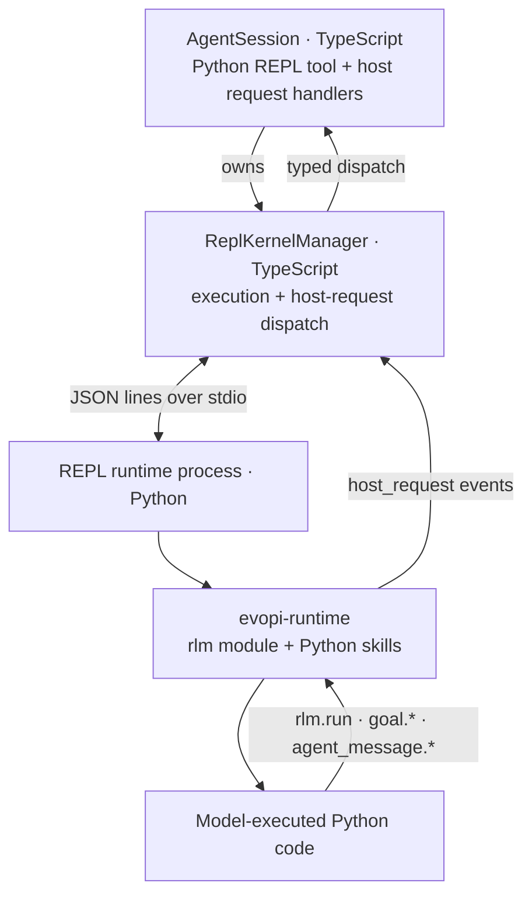
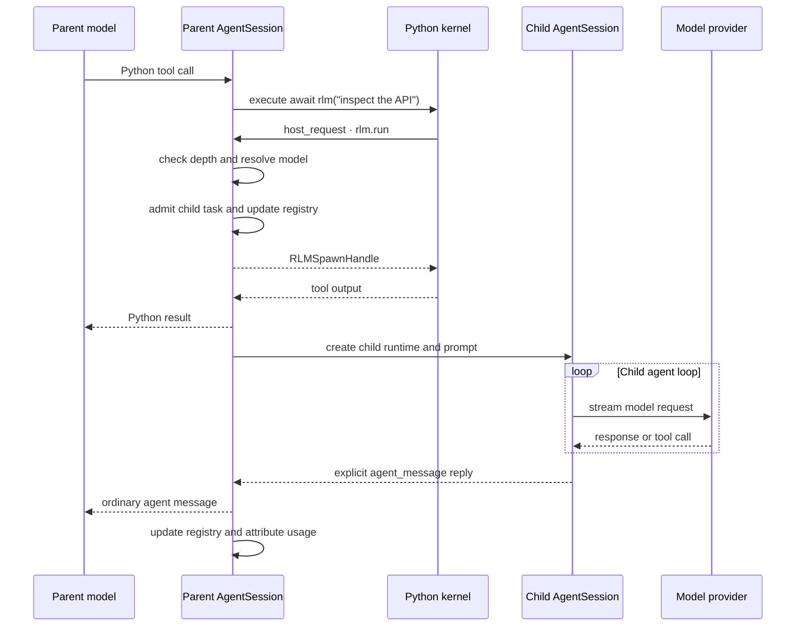

# RLM Runtime Architecture

evopi gives each agent session a persistent Python REPL kernel and a native recursive sub-agent interface. The Python `rlm` package is a model-facing shim; the TypeScript host owns child execution, persistence, usage accounting, and lifecycle.

## Architecture



When the model delegates work:

```python
handle = await rlm("inspect the API", name="api-reviewer")
print(handle.rlm_child_id, handle.name, handle.session_dir, handle.model)
```

the call travels as a `host_request` event over the runtime's stdio protocol. `ReplKernelManager` dispatches request type `rlm.run` to the parent `AgentSession`, which starts a child through the same TypeScript agent machinery as the parent. The call returns over the same bridge immediately after task admission with a child handle; it never waits for or returns the child's answer. Results arrive only through explicit `agent_message` replies or files.

The same bridge supports other typed host requests. Bundled Python skills such as `goal` call `rlm.host_request("goal.get", ...)`; state and policy remain in the TypeScript host.

## Delegation Flow



## Component Ownership

| Component | Responsibility |
|---|---|
| `src/core/kernel/repl-manager.ts` | Runtime process, stdio protocol, execution, host-request dispatch, interrupt, and shutdown. |
| `src/core/tools/ipython.ts` | Agent tool wrapper, lazy kernel provisioning, namespace bootstrap, and output shaping. |
| `src/core/agent-session.ts` | RLM policy, child creation, registry, usage attribution, cancellation, and goal handlers. |
| `src/core/rlm-runtime.ts` | Typed request/spawn-handle validation for `rlm.run`, model discovery, list, and delete. |
| `evopi-runtime/src/rlm/` | Python shim, handle types, callable `rlm`, and session-backed harness state. |

The Python side does not call providers or implement an agent loop.

## Kernel Lifecycle

The kernel is created lazily on first Python REPL use. Python resolution is:

1. `EVOPI_KERNEL_PYTHON`, when it has a current `evopi-runtime`;
2. `~/.evopi/agent/kernel-venv/bin/python`, bootstrapped with `uv`; or
3. the XDG data location when `~/.prime` is not writable.

The managed environment includes Python 3.11, `evopi-runtime`, `dill`, and the default Python packages. A bootstrap marker detects stale environments.

Startup spawns `python -m rlm.repl` and exchanges newline-delimited JSON over stdio: the runtime announces itself with a single `ready` event, then requests and events flow one JSON object per line (see `evopi-runtime/src/rlm/repl.md`).

The manager owns the child process and a bounded stderr tail. Shutdown sends a `shutdown` request, waits for the process to exit, and terminates it as a fallback. Persistent sessions may snapshot the kernel namespace into their session artifact directory for revival.

## Stdio Transport

Requests flow to the runtime on stdin and events return on stdout, one JSON object per line:

```text
requests  execute, interrupt, host_reply, snapshot, restore, list_names, shutdown
events    ready, stdout, stderr, result, display, host_request, error, done
```

Output events carry the id of the cell that was running when the bytes were produced; asyncio tasks keep their spawning cell's id even after that cell finishes, so detached work is attributed correctly.

Calls to `ReplKernelManager.execute()` are serialized. One kernel has one shared namespace and does not run two ordinary Python cells concurrently. RLM child agents can still run concurrently because each delegation uses a distinct host request and child runtime.

## Host-Request Event Flow

A running cell can await task admission:

```python
handle = await rlm("subtask")
```

The runtime ships the call to the host as a `host_request` event and keeps its event loop free while awaiting the reply. The host dispatches the typed request and answers with a `host_reply` request carrying the same id, so a cell can block on admission without stalling other runtime work. Child answers do not use this response path; they arrive later through explicit `agent_message` replies or files.

## Python API

`evopi-runtime` exports:

```python
rlm
run(prompt: str, **kwargs)
find_models(query: str = "", limit: int = 8)
list_subagents()
delete_subagent(selector)
host_request(request_type: str, payload: dict | None = None)
RLMSpawnHandle
RLMModel
RLMSubagent
```

The kernel bootstrap places the callable `rlm` object in the user namespace, so these are equivalent:

```python
await rlm("subtask")
await rlm.run("subtask")
```

`RLMSpawnHandle` contains `rlm_child_id`, `name`, `session_dir`, `model`, and `worktree` (the isolated worktree path, or `None` for shared-cwd children). It confirms admission only and never contains the child's answer.

Supported `rlm.run` options are:

- `name`: a unique readable child session name;
- `model`: an exact `provider/model` selector from `rlm.find_models()`;
- `thinking`: an explicit child reasoning level; must be valid for the resolved child model, defaults to the parent level (clamped to the child model); and
- `isolated`: `True` runs the child in an isolated git worktree, `False` forces the shared cwd (see [Worktree isolation](#worktree-isolation)). Only accepted when `subagent.worktree.mode` is `opt-in` or `always`; `None` (the default) is omitted from the request so the payload is unchanged.

Unknown options fail instead of being ignored. Model search is bounded to active, non-expired credentials. If an exact selection is unavailable or fails auth preflight, spawn fails instead of silently falling back to another model. A child otherwise inherits the parent model.

## Child Execution

`AgentSession.runRlmChild()` performs the following sequence:

1. Check `RLM_DEPTH < RLM_MAX_DEPTH`.
2. Resolve the requested model or inherit the parent model.
3. Create a `sub-xxxxxxxx` child directory under the parent artifact directory.
4. Admit the task into the parent registry and return its `RLMSpawnHandle`.
5. In detached work, create a child `SessionManager`, `Agent`, and `AgentSession`.
6. Reuse provider hooks, resource loader, model registry, tools, transport, retry settings, and thinking configuration.
7. Run the child prompt, retain its session, and update lifecycle state independently of the admission call.
8. Attribute child usage to the parent assistant turn and persist the attribution.

Children receive incremented `RLM_DEPTH`, the inherited maximum depth, and their own `RLM_SESSION_DIR`. The default maximum depth is 2, so root sessions may create children and grandchildren; grandchildren may not create another generation unless the limit is configured higher.

### Worktree isolation

By default every child shares the parent's working directory, so two children editing the same files race each other and a child's half-finished edits are visible to the parent immediately. `subagent.worktree.mode` (env `EVOPI_SUBAGENT_WORKTREE`) turns on git-worktree isolation (`core/subagent-worktree.ts`):

| Mode | Behaviour |
|---|---|
| `off` (default) | Shared cwd; `isolated=True` fails the spawn with an "isolation disabled" error. The spawn path, prompt, and handle are byte-identical to earlier releases. |
| `opt-in` | Only `await rlm("task", isolated=True)` is isolated. |
| `always` | Every child is isolated unless it passes `isolated=False`. A parent cwd that is not inside a git checkout falls back to the shared cwd and the parent is told so in the completion notice. |

An isolated child runs in a detached linked worktree at `<base>/<repoHash9>/<childId>` (`~/.evopi/agent/worktrees` by default; `subagent.worktree.base` or `EVOPI_WORKTREE_DIR` override it). A sibling `<childId>.owner.json` marker (`{pid, startedAt, childId, parentSessionId, repoRoot, worktreePath}`) is written before `git worktree add` so a crashed run can be told apart from a live one. Creation proceeds as follows:

1. `git rev-parse --show-toplevel` on the parent cwd; not a checkout → `isolated=True` fails, `always` falls back. A repository with no commits also fails.
2. The parent's uncommitted state (staged, unstaged, and untracked non-ignored files; `subagent.worktree.seedDirty`, default on) is measured; above `subagent.worktree.maxSeedBytes` (default 1 GiB) the spawn fails with the measured size and nothing is created. Gitignored content such as `node_modules/` is never copied, and nested repositories are skipped with a notice.
3. `git worktree add --detach <path> HEAD`, then the tracked diff is applied and untracked files are copied in.
4. A **baseline commit** is recorded inside the worktree (`user.name=evopi`, hooks and signing disabled, detached HEAD, so no parent branch moves). The child's delta is always measured against this baseline, which keeps the parent's WIP out of the captured patch.

The child's cwd, kernel process, tools, and system prompt all point at the worktree, and its doctrine tells it never to touch the original checkout. Isolated children are **not retained**: when the child's run settles the host disposes it first (so no kernel or shell keeps a cwd inside the worktree), then:

1. stages everything in the worktree's private index and captures `git diff --binary --cached <baseline>` (edits, additions, deletions, modes, binaries, and any commits the child made inside the worktree);
2. writes the delta to `<childSessionDir>/worktree.patch` (always, even when empty);
3. with `subagent.worktree.merge: "patch-apply"` (default) runs `git apply --check` and then a plain `git apply` in the parent working tree, serialised per repository. The parent's index is never touched; new files show up untracked. A patch whose reverse already applies is reported as "already applied". Any conflict (for example the parent edited the same hunk while the child ran) leaves the parent tree untouched and reports the retained patch path so it can be applied by hand; `merge: "none"` only keeps the patch file;
4. removes the worktree (`git worktree remove --force`, `rm -rf` fallback, marker unlinked, `git worktree prune`).

On error or cancellation the patch is captured and retained but never applied, and the worktree is removed. The parent receives a one-line notice such as `Isolated worktree: applied 3 files to /repo (...); patch saved at .../worktree.patch` or `Isolated worktree: patch NOT applied to /repo (<git apply stderr>); 1 file saved at .../worktree.patch. Apply manually with: git apply ...`.

Stale worktrees left by a crashed process are reclaimed by a best-effort asynchronous prune at session start and by `/worktree prune [--all] [--dry-run]`: entries whose owner pid is dead (or whose marker is unreadable) are removed; live entries and marker-less directories are kept unless `--all` is given; `--dry-run` only lists what would be removed.

Limitations in this version: no branch/cherry-pick merge mode; submodules are not initialised in the worktree; gitignored build artefacts (`node_modules`, `.venv`) must be recreated by the child; project-local `.evopi/agent` settings that are gitignored are not visible inside the worktree.

## Independent Delegation

Each direct call admits an independent child and returns its handle immediately:

```python
api_review = await rlm("review the API", name="api-reviewer")
test_review = await rlm("review the tests", name="test-reviewer")
audit = await rlm("slow independent audit", name="audit-reviewer")
```

End the turn instead of waiting for completion. Children send requested answers with `await agent_message.send(message, receiver_role="parent")`, and replies arrive as ordinary agent messages over later turns. A child may instead write results to files for the parent to read. The host runs each admitted child as an independent `AgentSession`; daemon-backed children can be retained as independently addressable session workers.

## Parent-Scoped Sub-Agent Registry

The TypeScript parent maintains the authoritative direct-child registry. `await rlm.list_subagents()` returns stable child IDs, active-session IDs when daemon-backed, session IDs, names, directories, and running/completed status.

This registry survives kernel restart, compaction, and parent restore. Successfully completed daemon-backed children are rehydrated from the parent artifact registry. Inline children remain inspectable in the current process but have no active-session ID.

The parent can continue a retained daemon child with `await agent_message.send(..., receiver_role="child", receiver_name=child.session_name)`. `rlm.delete_subagent()` accepts an exact child ID, active-session ID, session ID, or unique name. Deletion cancels or closes the runtime, writes a durable tombstone, and removes the child from messaging and observation. It does not erase the transcript or artifacts on disk.

Registry scope follows the parent transcript. An unrelated new parent session does not inherit children.

## Usage and Cost Attribution

The admission handle does not contain usage or completion data. evopi asynchronously folds the child's assistant usage and cost into the parent assistant turn that launched it.

The parent transcript persists a `child_usage_attributed` entry containing:

- the target parent assistant message ID;
- the child usage being attributed; and
- the resulting aggregate usage.

On reload, the aggregate is reapplied to the parent message. Context-tree reporting subtracts attributed child usage when showing each node's own usage, so tree-wide own usage and root aggregate totals remain reconcilable. Child work increases billable session totals but does not inflate the parent model's context-window measurement.

## Continual Harness State

`rlm.harness` is a persisted state ledger for prompt notes, memories, reusable skill descriptions, sub-agent specifications, and refinement events. It is not a second execution engine.

Session-local state lives in the session artifact directory under `harness/harness_state.json`. Explicitly global entries live under `~/.evopi/agent/harness/`. The Python store reloads after external modification so host-side `/refine` writes and kernel writes do not overwrite each other.

`/refine` runs a dedicated review over the current trajectory and applies small create/update/delete edits. Rollback uses recorded before/after snapshots. The base system prompt remains immutable; refinements are supplemental state.

### Progress ledger and recall (evo layer)

Two kernel-side helpers borrow the Progress/Experience split from EvoHarness-RL (arXiv 2608.05446) on top of the same store; they are additive methods on `HarnessState`, so old hosts keep working.

```python
rlm.harness.commit("Add failing test", "open", note="covers the regression")
rlm.harness.commit("Add failing test", "done")      # same slug → status update in place
rlm.harness.progress(include_done=False)           # ledger entries ordered by metadata.order
print(rlm.harness.plan())                          # "# PLAN (1/3 done)" + one line per subgoal
rlm.harness.recall("pytest venv", kind="memory", limit=3)
```

- `commit(subgoal, status="open", *, note=None, global_=False)` upserts a `memory` entry with id `progress:<slug>` and `metadata={"bpe": "progress", "status", "order", "updated_turn"}`. Status is one of `open | active | done | blocked` (anything else raises `ValueError`). At most 8 subgoals may be non-done; a ninth raises and asks you to mark one `done` first.
- `plan()` renders the ledger with `[x]` done, `[>]` active, `[ ]` open, `[!]` blocked.
- `recall(query, *, kind=None, limit=3, global_=False)` ranks non-progress entries by Jaccard similarity over lowercase word tokens of `title + content + path`, returns the top `limit` with similarity > 0, and increments `metadata["usage_count"]` on each hit (persisted; `version`/`updated_at` are untouched). No match returns `[]` without writing.

Host side, when the evo layer is on (`EVOPI_EVO`/`evo.enabled`, or `harness.selection: "mmr"` — the same gate as the MMR injection selector), the system prompt's harness section is rendered in BPE view: a `# PLAN` block (with the active goal objective, when any) is prepended, each injected entry is prefixed with its class (`[progress]`, `[experience]`, `[belief]` from `metadata.bpe`), progress entries are lifted out of the `memory` list so they do not consume injection slots, the guidance gains one sentence each for `rlm.harness.commit(...)` and `rlm.harness.recall(...)`, and `usage_count` adds `min(count, 10) * 0.02` to an entry's MMR relevance. With the gate off the harness section and system prompt are byte-identical to the stock output (`test/progress-ledger.test.ts`). The PLAN block reflects the ledger as of the last system-prompt rebuild (session start, tool changes, `/refine` completion, extension load); `rlm.harness.plan()` is always live.

## Goal Requests

The bundled `goal` Python skill is a thin host-bridge client:

```python
await goal.get()
await goal.create("ship the release", token_budget=200000)
await goal.complete()
```

Goal state, persistence, token and wall-clock accounting, and continuation prompting live in `AgentSession`. When goals are disabled, the skill and `goal.*` host handlers are not registered.

## Session Artifacts

For a persisted root session, the relevant layout is:

```text
~/.evopi/agent/
  sessions/
    <root-session-id>.jsonl
  session-artifacts/
    <root-session-id>/
      kernel-state.dill
      kernel-state.json
      scheduled-jobs.json
      edit-checkpoints/
        index.jsonl
        blobs/<sha256>
      harness/
        harness_state.json
      sub-xxxxxxxx/
        <child-session-id>.jsonl
        sub-yyyyyyyy/
```

Exact artifact files are created only when their features are used. Non-persistent sessions place RLM directories under the OS temporary directory and do not gain revivable session artifacts.

### Edit checkpoints and `/rewind`

Every edit made through the kernel `edit` skill is checkpointed so it can be undone with
`/rewind`. The before-image has to be captured **inside the kernel process**: the host only
learns about an edit from the `application/vnd.evopi.diff+json` display event, which it
processes after `write_text` has already rewritten the file. `skills/edit/src/edit/__init__.py`
therefore snapshots the file right before writing, but only when the host set
`EVOPI_EDIT_CHECKPOINT_DIR` on the kernel — the env var is present only for persistent sessions
with `editCheckpoint.enabled` (default on; `EVOPI_EDIT_CHECKPOINT=off` opts out), so with the
feature off or under `--no-session` the skill's code path is one `os.environ.get` away from the
previous behaviour and the diff payload is byte-identical. When enabled the payload gains a
`checkpoint_seq` field.

What is captured:

- `await edit(...)` in a cell (`source: "kernel"`), and the shell form `!edit --path ...`, which
  runs the skill CLI in a `bash()` subprocess with the same env (`source: "shell"`; listed as
  `(shell)` when it cannot be tied to a tool call).
- The host-side `hashline_edit` tool (`--tools hashline_edit`) snapshots each touched path before
  the Patcher applies (`source: "hashline"`).
- Each `/rewind` appends `kind: "rewind"` records for the files it restored, so a rewind is itself
  a checkpoint and can be undone by rewinding to it.

Not captured: `bash()` writes, raw Python I/O, external editors. `/rewind` is not a workspace
undo; it compares each file's live sha256 with the after-sha of its last checkpoint and refuses
(without `--force`) when a file changed outside the tracked editors since then.

Store layout (`edit-checkpoints/` under the session artifact dir): `index.jsonl` holds one
snake_case JSON record per edit (`seq`, `ts`, `kind`, `source`, `path`, `before_sha256`,
`before_bytes`, `after_sha256`, `start_line`, `cell_id`, optional `skipped: "oversized"` /
`rewind_of`); `blobs/<sha256>` are content-addressed before-images, so repeated edits of the same
state share one blob. Retention: 200 records / 64 MiB of unique blob bytes per session, pruned
oldest-first after each recorded edit; files above 4 MiB are recorded as `skipped` without a blob
(`editCheckpoint.maxRecords` / `maxTotalBytes` / `maxFileBytes`). The whole directory is removed
with the session.

Correlation: after every `ipython` / `hashline_edit` tool result the host reads the records
appended since its last cursor and persists an `edit_checkpoint` `custom` session entry
(`{ toolCallId, toolName, records }`). Custom entries never reach the model, so the context is
unchanged. `/rewind list` groups the current branch's entries by user turn and unions index
records no entry references.

`/rewind` is a session command (runs between turns, like `/compact`):

| Form | Effect |
|------|--------|
| `/rewind` | Interactive mode: picker (checkpoint, then `Files only` / `Files + conversation`). Elsewhere: same as `list`. |
| `/rewind list` | Numbered checkpoints with their files. |
| `/rewind <N\|seq>` | Restore every file edited at/after that checkpoint to its state before it (earliest before-image per path), atomically (temp + fsync + rename). Files only — the kernel namespace is untouched. |
| `--with-conversation` | Also navigate the session tree to that turn's user message (like `/tree`, no summary); the message text goes back into the editor. |
| `--force` | Overwrite files that drifted since their last checkpoint. |
| `--restart-kernel` | Restart the Python kernel afterwards (its namespace snapshot is revived on start; imports/handles are dropped). |

After a rewind the host appends a model-visible `edit_rewind_notice` custom message listing the
restored paths, so the model re-reads them instead of trusting its stale transcript. RLM children
checkpoint under their own artifact dir; a parent's `/rewind` does not list a child's edits.

## Trust Boundary

The REPL runtime process executes model-generated Python and `bash()` commands with the worker's OS permissions. The process boundary isolates protocol and lifecycle concerns; it is not a security sandbox. Installed Python packages, skills, and extensions are trusted code. Use an external sandbox or restricted execution environment when the workspace or generated code is untrusted.

Provider credentials are resolved by the TypeScript host. The bounded model catalog crosses into Python as metadata; the full auth store does not.

### Kernel environment and cell limits

The kernel process inherits the host environment **minus the agent's own
provider credentials** (`kernel-env.ts`): `ANTHROPIC_API_KEY`, `OPENAI_API_KEY`,
`EVOPI_API_KEY_POOL_*` and the other keys evopi itself authenticates with are
withheld, because provider calls never happen inside the kernel (they run in the
host, and `rlm()` subagents are dispatched over `host_request`). Set
`EVOPI_KERNEL_INHERIT_SECRETS=1` when a Python skill genuinely needs one.
Project credentials such as `GH_TOKEN`, AWS IAM variables and `SERPER_API_KEY`
pass through unchanged under the default `kernel.envPolicy: "denylist"`.
`kernel.envPolicy: "allowlist"` (or `EVOPI_KERNEL_ENV_POLICY=allowlist`) inverts
this: only a fixed safe set (`PATH`, `HOME`, locale, `TERM`, temp dirs, `XDG_*`,
`EVOPI_*`, Python tooling, CA bundles, proxies) plus the names in
`kernel.envAllow` (`"MYCO_*"` matches a prefix) reach the kernel, so unknown
`*_API_KEY`/`*_TOKEN` variables are withheld. The withheld names are listed in
the kernel diagnostics tail either way.

Each user cell is capped by `kernel.cellTimeoutMs` (default 30 minutes,
`EVOPI_KERNEL_CELL_TIMEOUT_MS` overrides, `0` disables). On expiry the runtime
is interrupted; if the cell still does not yield, the child is discarded and the
next cell lazily boots a replacement restored from the last snapshot. The model
sees the cell fail with `KernelCellTimeout` and a note describing which of the
two happened.

The cap is a per-request deadline inside `ReplKernelManager` (`activeDeadline`):
it starts after the busy-reuse wait, fires a one-shot `onTimeoutWarning` at 80%
(`DEFAULT_CELL_TIMEOUT_WARNING_RATIO`) for user cells only, and can be re-armed
mid-flight through `setActiveCellTimeout(ms)` (`0` removes the cap for that
cell; returns `false` once the cap has fired). `/kernel timeout <value>
[--global]` drives this from the chat: the new value is persisted in the session
log, applied to the running cell when possible, and re-read for every later cell
(`IpythonToolOptions.cellTimeoutMs` accepts a function), so no `/reload` is
needed. The `ipython` tool streams the 80% warning into its output, raises a TUI
warning toast, appends a trailing `[note: ...]` line to the result of any cell
that crossed 80%, and raises a TUI warning (clean interrupt) or error (kernel
restarted) on `KernelCellTimeout`. Host cells (snapshot, restore, repair) keep
their fixed internal caps and never warn.

## Failure Modes

| Failure | Behavior |
|---|---|
| Managed runtime is missing | Kernel bootstrap rebuilds it; a custom `EVOPI_KERNEL_PYTHON` without a current `evopi-runtime` is rejected at kernel startup. |
| Depth limit reached | The host rejects the `rlm.run` request; the error reply raises in Python. |
| Unsupported options | Host rejects the request. |
| `isolated=True` with `subagent.worktree.mode: off`, outside a git checkout, or above `maxSeedBytes` | Host rejects the request; no worktree is left behind. |
| Isolated child's patch conflicts with the parent tree | Parent tree untouched; patch retained at `<child-dir>/worktree.patch`; notice reports the path. |
| Requested model unavailable | Spawn fails instead of substituting another model. |
| Host connection closed | Pending `host_request` calls fail with `RuntimeError` so awaiting cells unblock. |
| Child cancellation | Host aborts the child and removes failed/cancelled registry entries. |
| Parent teardown | Active descendants are cancelled and their runtimes are closed. |

## Focused Validation

From the repository root, the implementation is covered by focused kernel, recursion, context-tree, daemon RLM, and runtime tests. When changing child creation or accounting, include `agent-session-recursion.test.ts`; when changing the stdio runtime protocol, include the `repl-kernel-*.test.ts` suites; when changing daemon retention, include the daemon RLM lifecycle tests.
